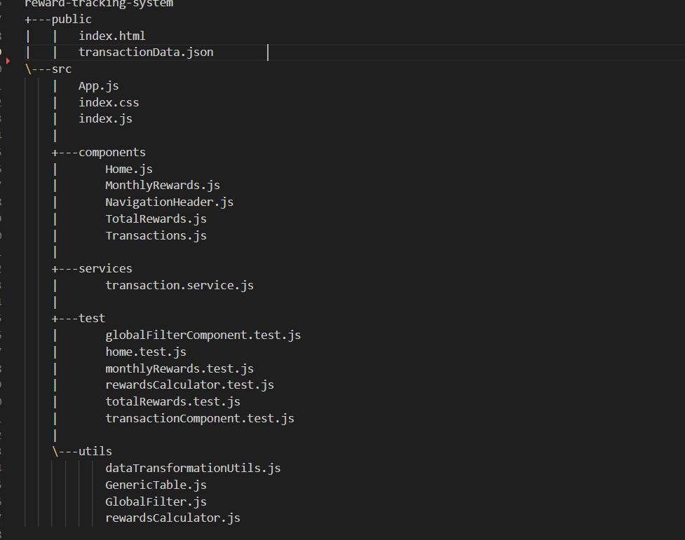
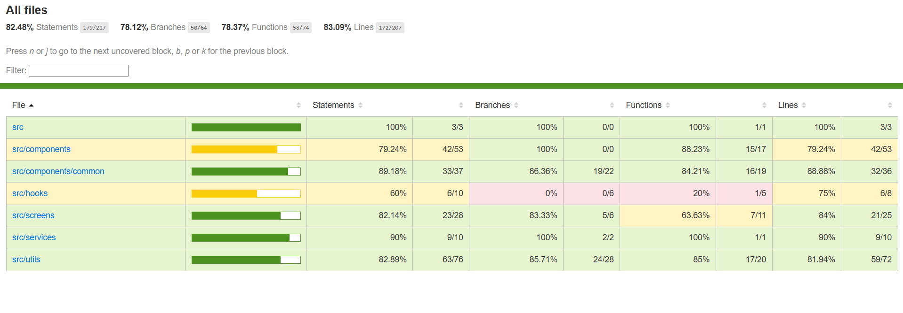

# Reward Tracking System

A React-based system that calculates and displays reward points earned by customers based on their transactions. The system aggregates rewards both monthly and in total, with features for sorting, filtering, and pagination.

# Features

- **Transaction Rewards Calculation:**

  - 0 points for purchases ≤ $50
  - 1 point for each dollar spent between $50 and $100
  - 2 points for each dollar spent over $100

- **Data Aggregation:**

  - **Monthly Rewards:** Aggregates reward points per customer per month
  - **Total Rewards:** Aggregates total reward points per customer

- **User Interface:**

  - Built with Material‑UI for a clean, responsive design
  - Implements sorting, filtering, and pagination
  - Autocomplete inputs for filtering by customer and product

- **Optimized Data Processing:**

  - Centralized helper functions for filtering, sorting, and pagination
  - Uses React hooks (e.g. `useMemo`) to reduce unnecessary re-renders

- **Simulated API:**
  - Fetches transaction data from a local JSON file with loading and error handling

### Project Directory Structure

A overview of the project's folder structure:

reward-tracking-system

### Screenshot

)
)
)
)
)
)
)

### Installation

1. **Clone the repository:**

   git clone https://github.com/ChitikshaAdhikar/reward-tracking-system
   cd reward-tracking-system

2. **Install dependencies:**

   npm install

### Running the Application

Start the development server with:

npm start

Open [http://localhost:3000](http://localhost:3000) in your browser.

### Running Tests

To run tests using Jest:

npm test

For watch mode:

npm test --watch

### Viewing Code Coverage

Jest includes built‑in support for generating code coverage reports:

Run tests with coverage:

npm test -- --coverage

### Test Coverage

## Usage

- **Data Fetching:**  
  Transaction data is fetched from a simulated API in transaction.service.js.

- **Reward Calculation:**
  Reward logic is defined in rewardsCalculator.js:

  - calculateRewardPoints(price)
  - getMonthlyRewards(transactions)
  - getTotalRewards(transactions)
  - getFilteredTransactions(transactions, globalFilter)

- **Data Transformation:**  
  Helper functions in dataTransformationUtils.js handle sorting, and pagination of data.

- **User Interface:**  
  The system provides interactive filtering, sortable columns, and pagination controls powered by Material‑UI.

- **Global Filter:**
  The GlobalFilter.js component offers input fields for Customer Name, From Date, and To Date along with Apply and Reset buttons. This component centralizes the filtering criteria used by other views.

- **Generic Table:**
  The GenericTable.js component in the utils folder is used to render tables across multiple views (Transactions, MonthlyRewards, TotalRewards) to ensure a consistent and reusable table UI.
