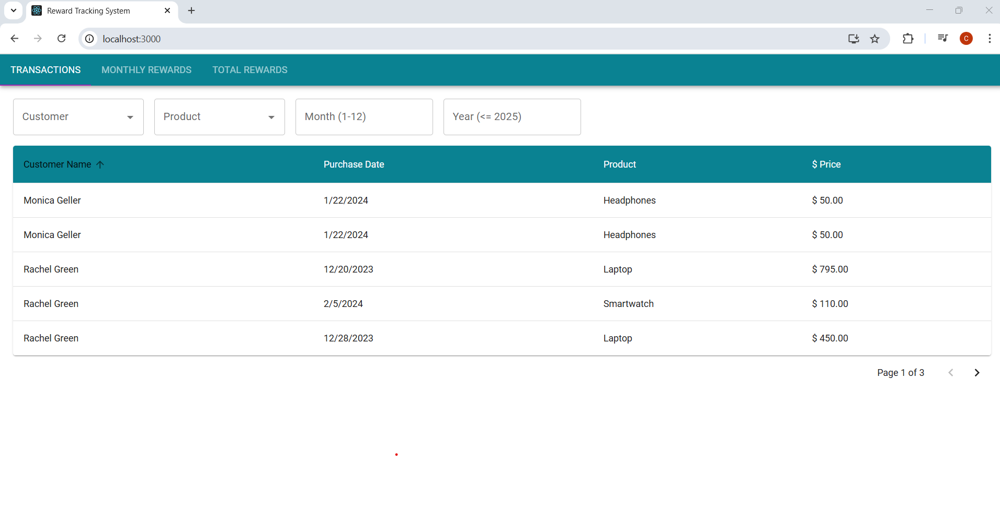
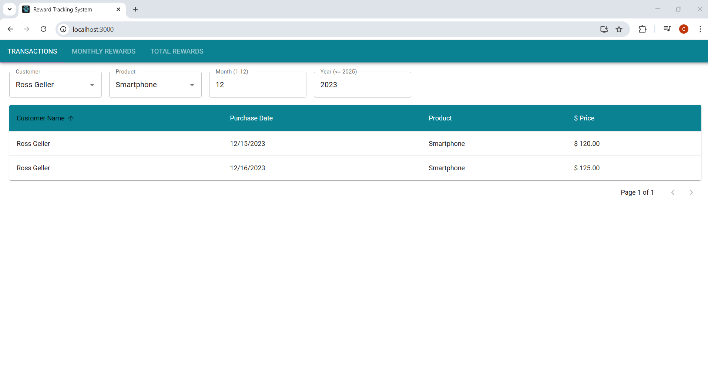
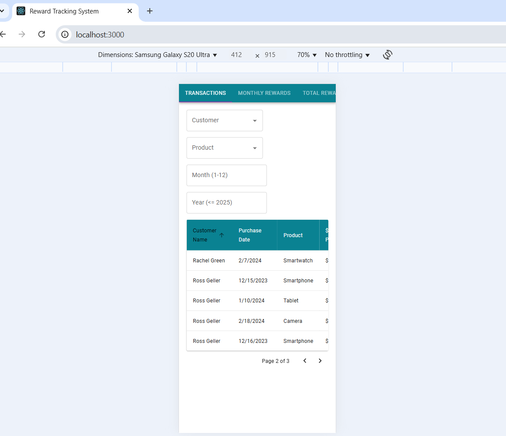
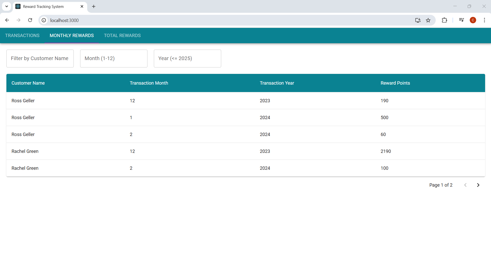
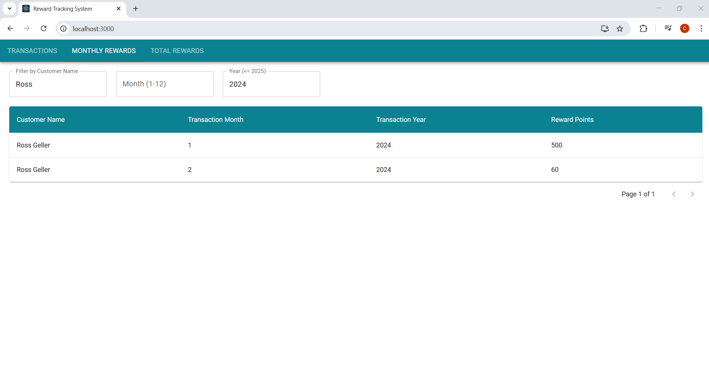
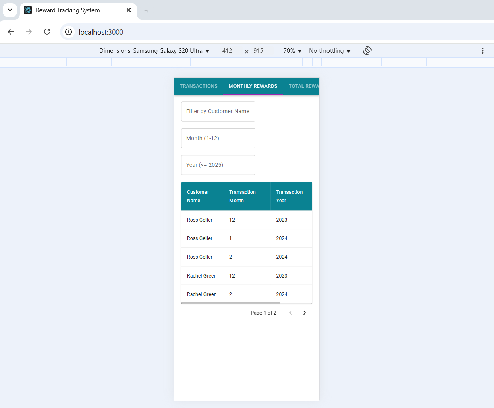
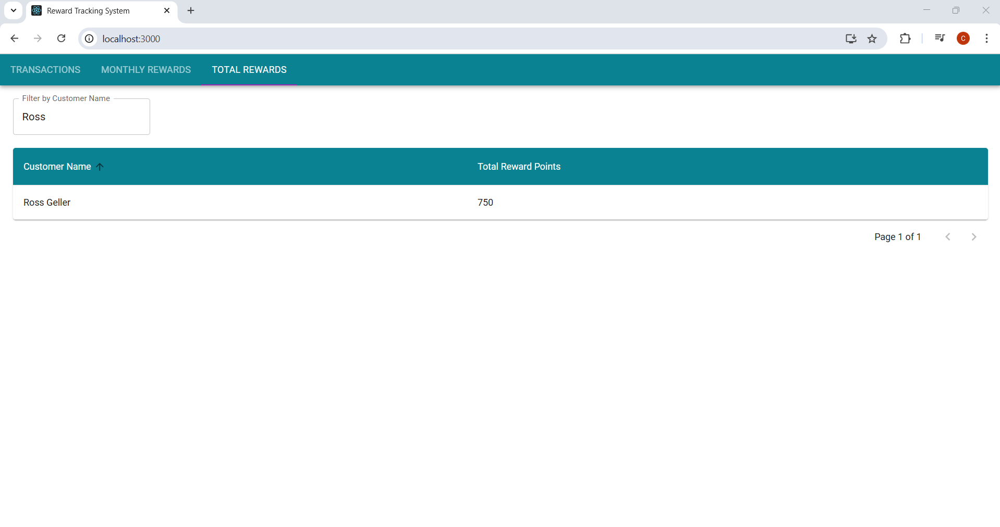
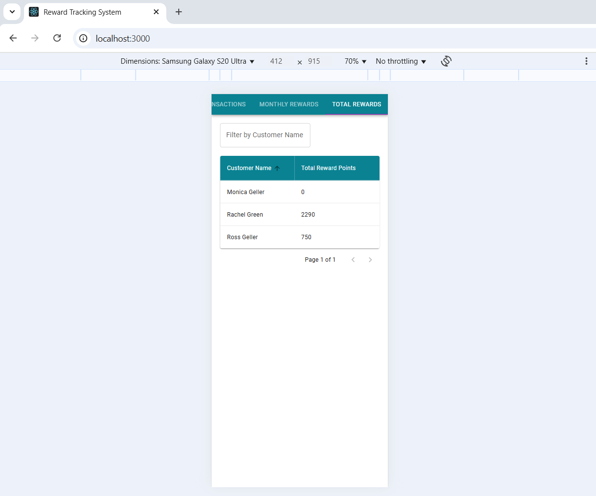

# Reward Tracking System

A React-based system that calculates and displays reward points earned by customers based on their transactions. The system aggregates rewards both monthly and in total, with features for sorting, filtering, and pagination.

# Features

- **Transaction Rewards Calculation:**

  - 0 points for purchases ≤ $50
  - 1 point for each dollar spent between $50 and $100
  - 2 points for each dollar spent over $100

- **Data Aggregation:**

  - **Monthly Rewards:** Aggregates reward points per customer per month
  - **Total Rewards:** Aggregates total reward points per customer

- **User Interface:**

  - Built with Material‑UI for a clean, responsive design
  - Implements sorting, filtering, and pagination
  - Autocomplete inputs for filtering by customer and product

- **Optimized Data Processing:**

  - Centralized helper functions for filtering, sorting, and pagination
  - Uses React hooks (e.g. `useMemo`) to reduce unnecessary re-renders

- **Simulated API:**
  - Fetches transaction data from a local JSON file with loading and error handling

### Screenshot

### Installation

1. **Clone the repository:**

   git clone <repository-url>
   cd <repository-folder>

2. **Install dependencies:**

   npm install

### Running the Application

Start the development server with:

npm start

Open [http://localhost:3000](http://localhost:3000) in your browser.

### Running Tests

To run tests using Jest:

npm test

For watch mode:
npm test --watch

## Usage

- **Data Fetching:**  
  Transaction data is fetched from a simulated API in transaction.service.js.

- **Reward Calculation:**
  Reward logic is defined in rewardsCalculator.js:

  - calculateRewardPoints(price)
  - getMonthlyRewards(transactions)
  - getTotalRewards(transactions)

- **Data Transformation:**  
  Helper functions in dataTransformationUtils.js handle filtering, sorting, and pagination of data.

- **User Interface:**  
  The syatem provides interactive filtering (via Autocomplete and TextField inputs), sortable columns, and pagination controls powered by Material‑UI.

